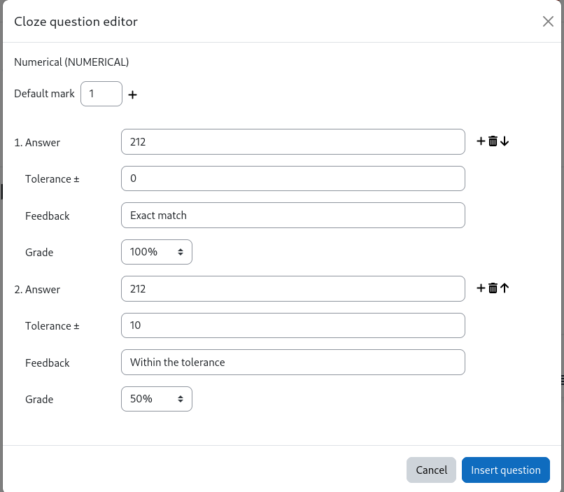
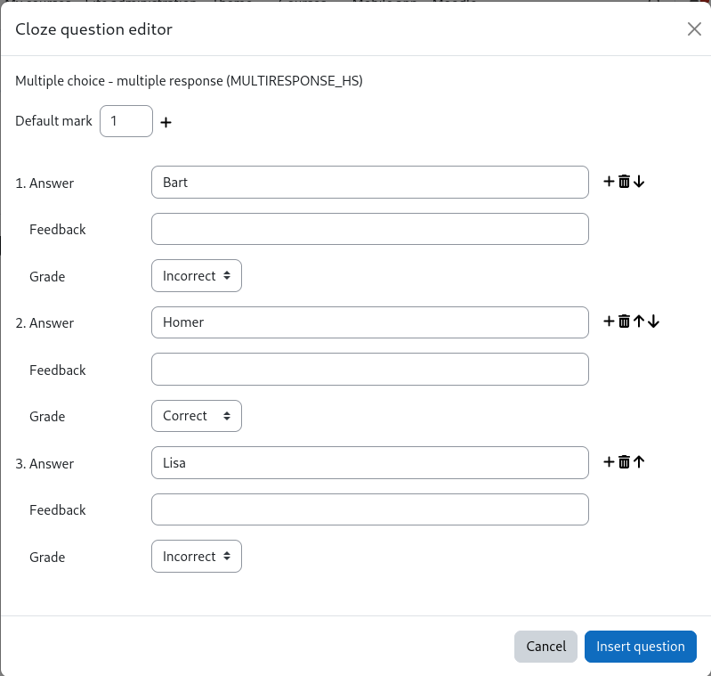

Moodle Tiny editor Cloze question type button
=============================================

Created collaboratively at [MoodleMoot DACH 23 Zurich](https://moodlemootdach.org/).

A plugin for the Moodle Tiny editor to allow easier creation of Cloze questions
see https://docs.moodle.org/en/Embedded_Answers_(Cloze)_question_type.
Inspired by the Atto Cloze editor https://docs.moodle.org/en/Cloze_editor_for_Atto.

## Overview

This is an editor plugin to provide an interface for creating and
modifying embedded answer (Cloze) questions. To install, add a new directory
named `cloze` in `lib/editor/tiny/plugins`, unzip the content of this zip archive
into the newly created directory and visit notifications to update database.

This plugin requires Moodle 4.1 or later as that ships with a new version of the Tiny
editor and the Atto editor is due to be phased out in a future version of Moodle.

## Installation

 - Copy repository content in *moodleroot*/lib/editor/tiny/plugins. The following can be omitted:
   - tests/ (if you're not going to test it with Behat)
   - .gitmodules
   - build.xml
   - screenshots
 - Install the plugin from Moodle. 

There are no settings for the plugin that can be set in the Moodle Site administration.

## Usage

The button  should appear in the editor only
while editing embedded answer (Cloze) questions. The icon does not appear when editing
any other text field (whether it's a different question type or not even the question
text field). You will notice that in a Cloze question below the question
text in the feedback area the icon is missing.

### Create a new question

To create a new Cloze question in the text, position the cursor at the desired place
and click on the  button inside the editor
toolbar or use the "Insert" -> "Cloze question editor" menu item.

A popup window will let you choose any of the available question types.

Selecting any question type, you will see a plain language description of what that
question type does. Select one question type and then click the "Select question type"
button to actually define the answers and grading information for that question type.

In this particular case a numerical question is defined. The correct answer (e.g of the
question of the boiling point of water in Fahrenheit) would be 212. However, there
is a tolerance of 10 Fahrenheit above or below the exact answer still to be graded with
0.5 points. The mark (in this case 1 point) is defined at the very top.

Finally, clicking "Insert question" adds the resulting Cloze question syntax into the
question text at the cursor position.

### Edit an existing question

To edit an existing question, please position the cursor in the editor somewhere at the
question text and click. This will select the whole question and the icon is highlighted
as in this screenshot:

When the toolbar button to edit the Cloze question is clicked, a dialogue window opens
to edit the answers of that question in the text.

Here you see the predefined answers that come from the question string in the text.
There is one correct and four incorrect answers (the last two answers are out of sight
and must be scrolled to view it). These possible answers are displayed as a selection
inside the text. This particular screenshot also demonstrates how to use one question
in different languages using the multilang2 filter.

Once you are done with the changes, click the button "Insert question" to apply the
changed question string on the existing question.

### Technical details

Cloze questions come in a variety of question types. For some of the questions more
than one notation can be used, e.g. MC and MULTICHOICE refer to the same question type.
Whenever a question is edited that uses the abbreviation of the question type, upon
saving the changes with the plugin, the question type will use the long form. That does
not change any of it's behaviour, but is just a convention.

Multilang elements can be used in the reponses and in the feedback strings. However,
you must use the Moodle annotation with the  elements. The multilang2 filter
is not supported here. For more information please checkout the Moodle documentation
at https://docs.moodle.org/en/Multi-language_content_filter.

## History

### v1.0
- First release

### v0.1.0
- Start working on the project.